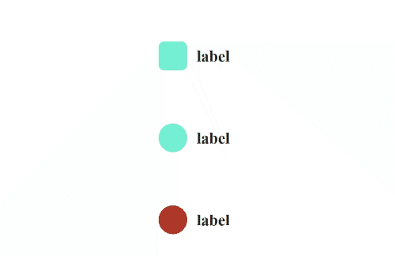

# react-radio-css

A radio button based on react thats easy to customize

## Example



## Usage

```js
import React from "react";
import Radio from "react-radio-css";

function App() {
  const [isSelected, setIsSelected] = React.useState(false);
  return (
    <Radio
      value={isSelected}
      label="label"
      labelColor="#242424"
      checkedColor="#242424"
      unCheckedColor="#7fffd4"
      iconColor="#ffffff"
      onChange={() => {
        isSelected ? setIsSelected(false) : setIsSelected(true);
      }}
    />
  );
}
```

## Props

Common props you may want to specify include:

- `value` - value of radio
- `label` - set label of radio
- `labelColor` - set color of label of radio
- `checkedColor` - set background color of radio when checked
- `unCheckedColor` - set background color of radio when unchecked
- `iconColor` - set color of check icon
- `onChange` - onchange function of radio
- `style` - can do custom styling

## Available Scripts

In the project directory, you can run:

### `npm start`

Runs the app in the development mode.\
Open [http://localhost:3000](http://localhost:3000) to view it in your browser.

This has a starter project using this package you can test it there

### `npm run build`

Builds the package for production to the `dist` folder.\
